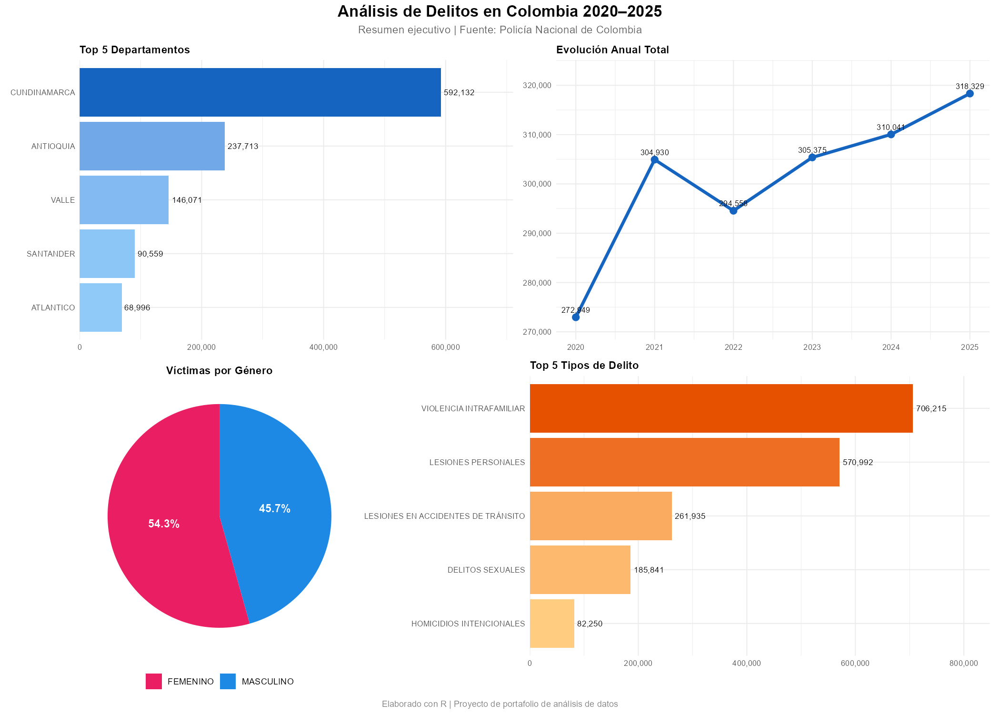
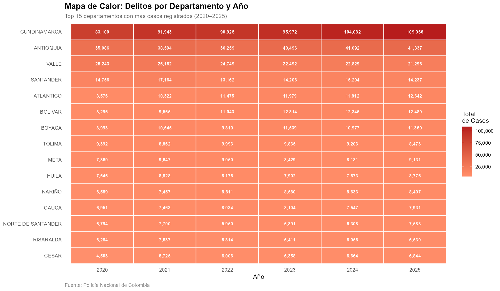
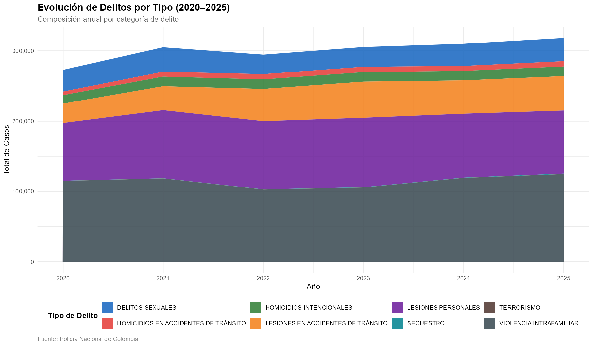
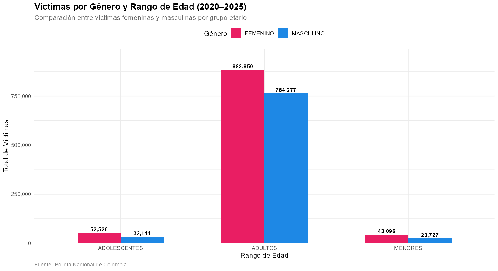

# Análisis de Delitos en Colombia 2020–2025

## Descripción
Análisis exploratorio y visual de más de 1,000,000 registros de delitos
registrados por la Policía Nacional de Colombia entre 2020 y 2025.

## Herramientas utilizadas
- **R** con las librerías: tidyverse, ggplot2, lubridate, scales, patchwork
- **RStudio** como entorno de desarrollo

## Estructura del proyecto
| Archivo | Descripción |
|---------|-------------|
| `fase1_limpieza_eda.R` | Limpieza de datos y análisis exploratorio |
| `fase2_analisis.R` | Análisis de preguntas clave |
| `fase3_visualizaciones.R` | Visualizaciones finales para portafolio |

## Visualizaciones

### Panel Resumen

### Mapa de Calor por Departamento

### Evolución por Tipo de Delito

### Víctimas por Género y Edad

## Conclusiones principales
- **Bogotá, Antioquia y Valle del Cauca** concentran la mayor cantidad de delitos
- Los delitos muestran una tendencia variable entre 2020 y 2025
- Las **mujeres** son las principales víctimas de violencia intrafamiliar
- Los **hombres adultos** son el grupo más afectado por homicidios

## Autor
Diego — Analista de datos en formación  
Contacto: https://www.linkedin.com/in/diego-jes%C3%BAs-bastidas-sandoval-aba084416/?locale=es
